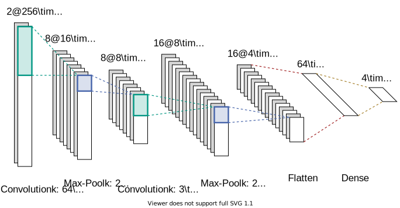

# Ultra-low Power Machinery Fault Detection Using Deep Neural Networks
## Contents
- [Introduction](#introduction)
  - [Getting started](#getting-started)
  - [Using custom datasets and hyperparameters](#using-custom-datasets-and-hyperparameters)
- [Datasets](#datasets)
  - [Proprietary Siemens pump dataset](#proprietary-siemens-pump-dataset)
  - [Case Western Reserve University dataset](#case-western-reserve-university-dataset)
  - [Paderborn University dataset](#paderborn-university-dataset)
- [Neural networks](#neural-networks)
  - [Structure](#structure)
  - [Hyperparameters](#hyperparameters)
- [Detailed results](#detailed-results)

## Introduction
This repository is supplementary to the paper "Ultra-low Power Machinery Fault Detection Using Deep
Neural Networks" proposed for the [ITEM Workshop 2021](https://www.item-workshop.org/). Next to some
usage instructions it contains the code used for training the neural networks and the public
datasets that have been used to validate the developed models. Also, some in depth descriptions of
the hyperparameters and the achieved results can be found here.

### Getting started
There are two scripts for training the neural network models provided in the repository. They
provide a demonstration of how a normal training and a parameter scan with the model definitions
used in the paper can look like. Some additional python packages need to be installed for the
scripts to function properly. To install those dependencies, run the following command:
```bash
python -m pip install -c pip_constraints.txt tensorflow pandas matplotlib keras_flops scipy talos
```

The `main_single.py` script trains one network type with a given set of hyperparameters. The
parameters can be altered inside the `model_params` variable. To execute the script, run:
```bash
python main_single.py <model_type>
# <model_type> may be one of the following:
# cnn, dscnn, wdcnn, dnn
```

The `main_scan.py` script performs a hyperparameter scan over the parameters given in the
`models/params.py`. They are specified as a python dictionary with a list for each parameter to be
scanned. For each permutation of parameters, one training run is performed. After the training,
tests on the model and its 8-bit quantized version are conducted. The results of the scan is saved
to a new directory called `talos_scans`. To run the scan, execute the following command:
```bash
python main_scan.py [<model_type>, <model_type>, ...]
# The additional <model_type> arguments are optional.
# When they are left empty, all available model types
# are scanned.
```

### Using custom datasets and hyperparameters
It is possible to expand this project to use a different dataset or set of hyperparameters. The
easiest way to add a new dataset is to try and integrate it into the existing data loading and
preparation pipeline. In the `data/data_fns.py` file the `class_load` function can be extended to
also be able to use load a different kind of dataset. New data configurations can be added inside
the `data/data.py` file. Apart from that, completely custom loading data pipelines can be used as
well. The only constraint is that the model definition functions inside the files in the `models`
directory expect data input with shape `(num_samples, axis_1, axis_2, num_channels)` and a targets
in shape of `(num_samples, num_classes)` with one-hot encoding.

The hyperparameters for the parameter scans are given in the `models/params.py` file. There, new
sets of parameters can be added to be used in the `main_scan.py` script. Also new model types with
new parameters can be added by creating a model file in the `models` directory and an entry in the
`params` field in the parameters file.

## Datasets
### Proprietary Siemens pump dataset
This dataset has been obtained using a KSB Etabloc centrifugal pump with a test rack at the Siemens
facility in Karlsruhe. An accelerometer attached to the housing of the pump was used to record the
data. A schematic of the rack can be seen below.


A total of four different operating states have been evoked during data collection. These include a
nominal state, weak cavitation, strong cavitation and a hydrolock. The respective pressure and flow
measurements can be found in the table below.

| State       | P1 (bar)    | P2 (bar)    | Q (l/h)   |
| ----------- | ----------- | ----------- | --------- |
| Normal      | 1.05        | 1.00        | 1000      |
| Weak Cav.   | 0.99        | 0.75        | 7000      |
| Strong Cav. | 0.92        | 0.42        | 11000     |
| Hydrolock   | -           | -           | 0         |

The data is measured in intervals of 30 seconds over the course of approximately one hour. Each
measurement has a sample size of 512 samples per axis for all three axes. The sample rate is 6.66
kHz, which results in a sample time of 76.8 ms. For all neural network models, only two axes and
256 samples per axis are used, resulting in an input of 512 values with a frame length of 38.4 ms.

### Case Western Reserve University dataset
The [Case Western Reserve University (CWRU)
dataset](https://csegroups.case.edu/bearingdatacenter/pages/download-data-file) uses artificially
damaged bearings that show three different fault patterns (inner race, outer race and ball faults)
and three fault sizes (0.007 in., 0.014 in. and 0.021 in.). The data with a sample rate of 12 kHz
from the accelerometer at the drive end is selected, while all four motor loads from zero to three
horsepower are combined for each class. Together with data from healthy bearings this results in a
classification dataset with 10 classes.

The dataset only provides one axis, so only one dimension can be utilized by the models. Because the sample rate is almost doubled in comparison to the Siemens dataset, 512 values get used per inference, leading to a frame length of 42.667 ms.

### Paderborn University dataset
The [Paderborn University dataset](http://mb.uni-paderborn.de/kat/datacenter) provides data obtained
from bearings with real damages caused by accelerated life tests. The data from 10 damaged bearings
and 5 healthy bearings gets combined to form a dataset with three classes based on the fault
location. All three operating states are combined to form a more diverse dataset.

The dataset has a sample rate of 64kHz, but is subsampled by a factor of four to be similar in
sample rate to the two other datasets. To capture a similar time slot, the length of the frame fed
into the networks is increased to 1024 for this dataset. With only one axis this leads to an input
size of 1024 and a frame length of 64 ms.

## Neural networks
The neural networks used in this work are mostly variations of Convolutional Neural Networks (CNNs).
They are a popular architecture because they are able to learn and detect patterns in arbitrary
input data. For the task of machinery and bearing fault detection however, the capability of
traditional CNNs to capture periodic changes in the signal is limited. Therefore, one dimensional
CNNs with wide first layer kernels are used to increase the receptive field of the networks, as
introduced in [this
paper](https://www.ncbi.nlm.nih.gov/pmc/articles/PMC5336047/pdf/sensors-17-00425.pdf).

### Structure
In this work we consider three different variations of CNNs and one Dense Neural Network (DNN). The
variants and the abbreviations used in the following are:
- one layer CNN with wide kernel layer (CNN)
- two layer CNN with a wide kernel first layer and a small kernel [depth-wise
  separable](https://towardsdatascience.com/a-basic-introduction-to-separable-convolutions-b99ec3102728)
  layer (DS-CNN)
- three layer CNN with a wide kernel first layer and two small kernel layers (WDCNN)
- two layer DNN with two layers (DNN)

Every network uses a dense layer in the end with a softmax classifier and contains a batch
normalization before every convolutional or dense layer. After every convolutional layer, a max
pooling layer is present. A dropout of 0.1 is used to prevent overfitting. The batch size for
training is 128, the learning rate is 0.004. The training lasted for 50 epochs. All model
definitions can be found in the `models` directory. The figure below illustrates the structure of
the convolutional networks used for the Siemens dataset. The only difference for the other datasets
are the input dimensions and the size of the output layer, which matches the number of classes.
Depending on the variation, the number of convolutional layers and the shape and number of kernels
changes.



### Hyperparameters
The hyperparameters listed in this section include the following:
- kernel size: shape of the first convolutional layer's kernels
- kernel stride: stride of the first convolutional layer's kernels
- number of filters: the number of filters for each convolutional layer, given as a tuple `(layer1,
  layer2, ...)`
- first layer: size of the first dense layer of the DNN
- second layer: size of the second dense layer of the DNN

Each convolutional layer following the first has a kernel size of `(3, 1)` and a stride of `(1, 1)`.

For the **Siemens dataset**, the input is a tensor with shape `(256, 1, 2)`, meaning it is a one
dimensional time series with two channels (x-axis and y-axis of the accelerometer data). The
hyperparameters for the best performing networks are given in the table below:

| Network (Siemens) | kernel size | kernel stride | number of filters | first layer | second layer |
| ----------------- | ----------- | ------------- | ----------------- | ----------- | ------------ |
| CNN               | (64, 1)     | (8, 1)        | (32)              | -           | -            |
| DS-CNN            | (32, 1)     | (16, 1)       | (8, 16)           | -           | -            |
| WDCNN             | (32, 1)     | (8, 1)        | (8, 16, 32)       | -           | -            |
| DNN               | -           | -             | -                 | 16          | 0            |

The models using the **CWRU dataset** receive an input with the shape `(512, 1, 1)`, since the
dataset only provides one channel. The hyperparameters are listed below:

| Network (CWRU) | kernel size | kernel stride | number of filters | first layer | second layer |
| -------------- | ----------- | ------------- | ----------------- | ----------- | ------------ |
| CNN            | (64, 1)     | (16, 1)       | (40)              | -           | -            |
| DS-CNN         | (128, 1)    | (32, 1)       | (20, 40)          | -           | -            |
| WDCNN          | (32, 1)     | (8, 1)        | (8, 16, 32)       | -           | -            |
| DNN            | -           | -             | -                 | 16          | 32           |

With the **Paderborn dataset** an input shape of `(1024, 1, 1)` was used. The hyperparameters are as
follows:

| Network (Paderborn) | kernel size | kernel stride | number of filters | first layer | second layer |
| ------------------- | ----------- | ------------- | ----------------- | ----------- | ------------ |
| CNN                 | (128, 1)    | (32, 1)       | (48)              | -           | -            |
| DS-CNN              | (128, 1)    | (32, 1)       | (20, 40)          | -           | -            |
| WDCNN               | (64, 1)     | (16, 1)       | (8, 16, 32)       | -           | -            |
| DNN                 | -           | -             | -                 | 8           | 16           |

## Detailed results
The results shown below use the following metrics:
- accuracy: classification accuracy of the model
- converted accuracy: classification accuracy of the 8-bit quantized model
- parameters: number of model parameters
- model size: size of the 8-bit quantized model in the `.tflite` binary format
- FLOPs: number of floating point operations required per inference

**Siemens**
| Network | accuracy (%) | converted accuracy (%) | parameters | model size (B) | FLOPs  |
|---------|--------------|------------------------|------------|----------------|--------|
| CNN     | 100          | 100                    | 6188       | 11056          | 269348 |
| DS-CNN  | 99.97        | 99.93                  | 988        | 8400           | 21076  |
| WDCNN   | 100          | 100                    | 3108       | 12256          | 73908  |
| DNN     | 83.28        | 83.59                  | 8348       | 12320          | 17716  |

**CWRU**
| Network | accuracy (%) | converted accuracy (%) | parameters | model size (B) | FLOPs  |
|---------|--------------|------------------------|------------|----------------|--------|
| CNN     | 99.99        | 99.72                  | 9014       | 14256          | 180290 |
| DS-CNN  | 99.99        | 99.54                  | 5174       | 14320          | 101690 |
| WDCNN   | 100          | 99.68                  | 4902       | 14144          | 116946 |
| DNN     | 87.43        | 84.11                  | 9159       | 14128          | 19314  |

**Paderborn**
| Network | accuracy (%) | converted accuracy (%) | parameters | model size (B) | FLOPs  |
|---------|--------------|------------------------|------------|----------------|--------|
| CNN     | 99.92        | 99.75                  | 8503       | 14000          | 402968 |
| DS-CNN  | 99.89        | 99.12                  | 4527       | 13776          | 198672 |
| WDCNN   | 99.62        | 98.13                  | 3309       | 12752          | 147112 |
| DNN     | 69.26        | 68.05                  | 8431       | 13440          | 18896  |

## License
This work is licensed under the Creative Commons Attribution-NonCommercial 4.0 International License. To view a copy of this license, visit http://creativecommons.org/licenses/by-nc/4.0/. For licenses of the Case Western Reserve University and Paderborn University datasets please see the respective subfolders.
